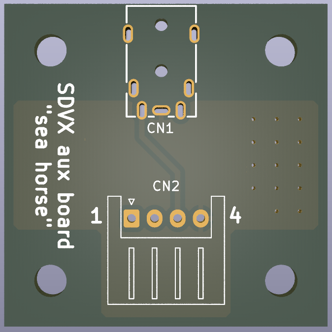

# SDVX-aux-board

# HAS SMALL ERROR THAT NEEDS TO BE FIXED, DO NOT ORDER

A replica of the aux board PWB111383270000 "sea horse" found in Sound Voltex cabs.

It makes use of a horizontal XH-4 female connector and an unidentified audio jack. For ease of manufacturing I decided to use a more common type of headphone jack (As I was also not able to identify the used jack). The official cycle time of that headphone jack is 5000 cycles. I also could not find any other brands which guaranteed a longer cycle time. While this is not a lot, the cheapness of the part will make replacing the jack a lot easier. The original metal bracket can still be used because the new audio jack is smaller in width.

| Item                 | part#              | lcsc part# | quantity |
|----------------------|--------------------|------------|----------|
| 3.5mm headphone jack | PJ-3910-7A         | C707257    | 1        |
| 1x4P XH 1 2.5mm      | S4B-XH-A-1(LF)(SN) | C163037    | 1        |
